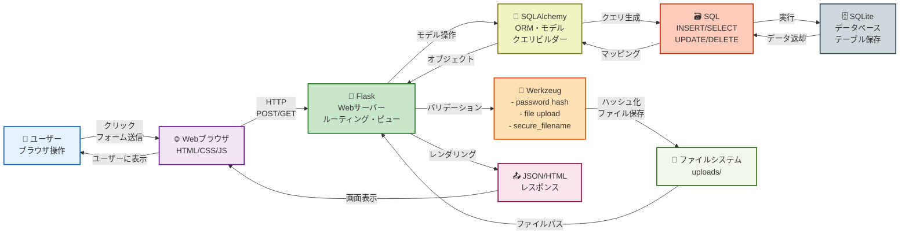
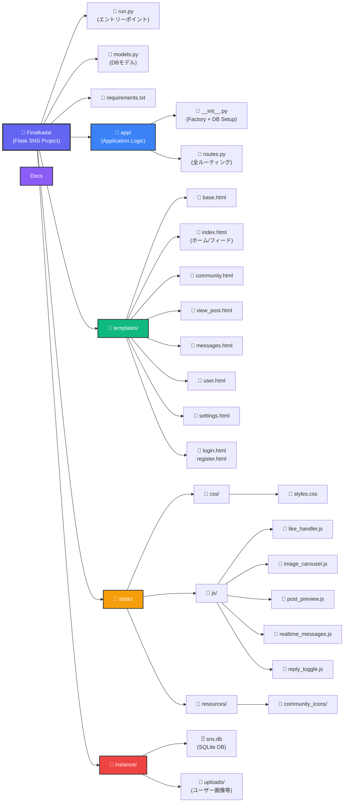
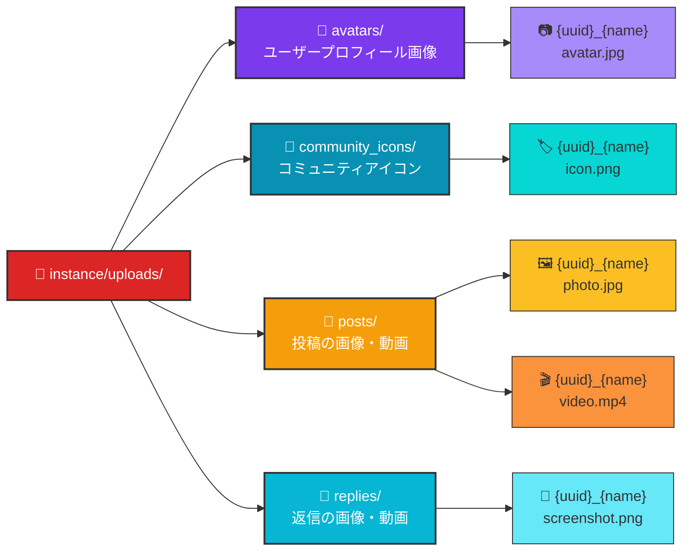
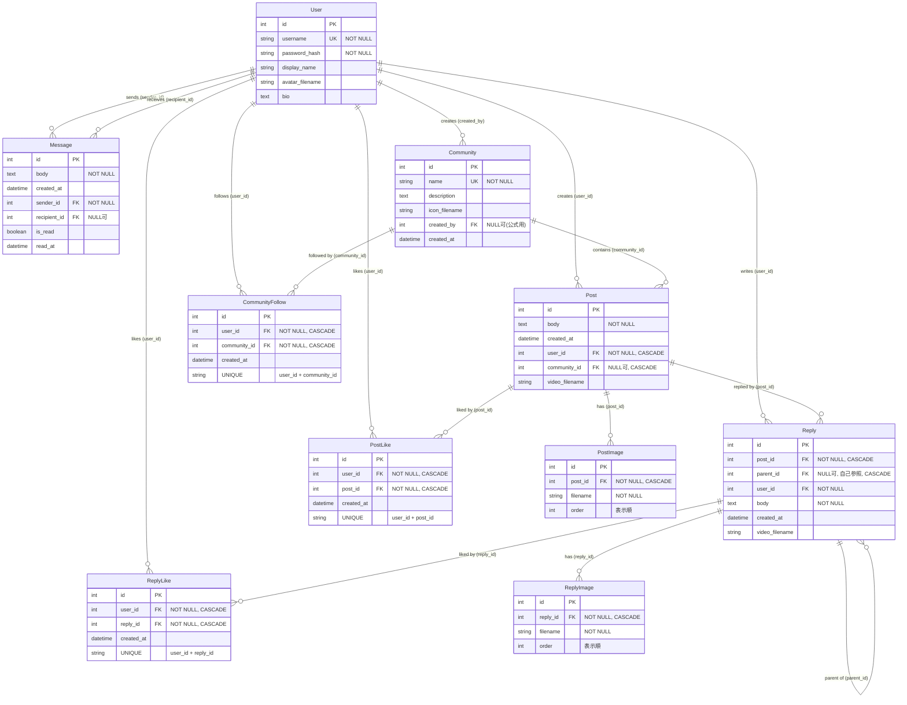

# グループC
メンバー 原匠生 2442067 , 渡辺海斗 2442099 
使い方 : 
1. 任意のディレクトリにて`git clone https://github.com/tegrafuse/Saisyukadai.git` 
2. 構築を構築する。Windowsの場合は`./setupproject.bat` 
Windows以外の場合は`python -m venv venv`, `source venv/bin/activate`, `pip install -r requirements.txt` 
3. `python run.py`　※Windowsの場合は`./start.bat` 
4. ブラウザにて[http://127.0.0.1:5000](http://127.0.0.1:5000) 

---

## デモ動画

https://github.com/user-attachments/assets/demomovie.mp4

---

## アーキテクチャ

---

## システムダイアグラム

### 全体構造

### ファイルアップロード構成

---

## ER図

