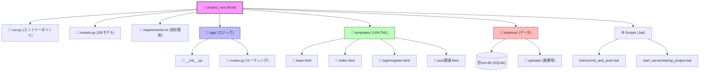

```mermaid
graph TD;
    Root["📁 project_root (Root)"]
    
    %% Python core files
    Root --> run_py["📄 run.py (エントリーポイント)"];
    Root --> models_py["📄 models.py (DBモデル)"];
    Root --> req_txt["📄 requirements.txt (依存関係)"];
    
    %% App directory
    Root --> AppDir["📁 app/ (ロジック)"];
    AppDir --> app_init["📄 __init__.py"];
    AppDir --> app_routes["📄 routes.py (ルーティング)"];
    
    %% Templates directory
    Root --> TempDir["📁 templates/ (UI/HTML)"];
    TempDir --> base_h["📄 base.html"];
    TempDir --> index_h["📄 index.html"];
    TempDir --> auth_h["📄 login/register.html"];
    TempDir --> post_h["📄 post関連.html"];
    
    %% Instance directory
    Root --> InstDir["📁 instance/ (データ)"];
    InstDir --> db_file[("🗄️ sns.db (SQLite)")];
    InstDir --> upload_dir["📁 uploads/ (画像等)"];
    
    %% Scripts
    Root --> BatchDir["⚙️ Scripts (.bat)"];
    BatchDir --> git_bat["init/commit_and_push.bat"];
    BatchDir --> start_bat["start_server/startup_project.bat"];

    %% Styles
    style Root fill:#f9f,stroke:#333,stroke-width:2px
    style AppDir fill:#bbf,stroke:#333
    style TempDir fill:#bfb,stroke:#333
    style InstDir fill:#fbb,stroke:#333
```