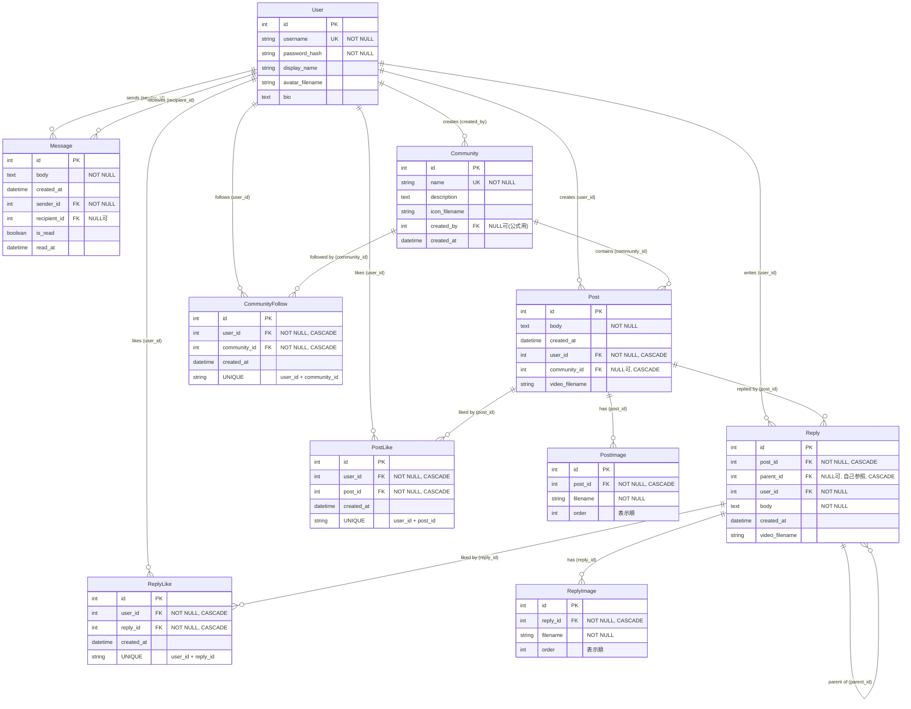

# Tamariba データベース設計: 正規化とフォレインキー解説

## 正規化レベルの概要

このシステムは**第3正規形（3NF）**を満たすよう設計されています。

### 第1正規形（1NF）
✅ **達成**: すべてのテーブルは以下の条件を満たしています
- すべての列が原子的な値（分割不可能な単一値）を持つ
- 各行が一意に識別可能（主キーが存在）
- 繰り返しグループが存在しない

**具体例:**
- 投稿に複数の画像を持たせる場合、Post テーブルに画像URLをカンマ区切りで格納するのではなく、PostImage という別テーブルに分離
- ユーザーの複数の投稿も、User テーブル内に配列として格納せず、Post テーブルで管理

### 第2正規形（2NF）
✅ **達成**: すべての非キー属性が主キー全体に完全関数従属
- 部分関数従属（複合キーの一部だけに依存する属性）が存在しない

**具体例:**
- `CommunityFollow` テーブル: `(user_id, community_id)` の組み合わせで一意だが、`created_at` は両方のキーに依存
- `PostLike` / `ReplyLike`: 同様に複合キーに完全従属

### 第3正規形（3NF）
✅ **達成**: すべての非キー属性が主キーに直接依存（推移的関数従属の排除）
- どの非キー属性も、他の非キー属性を経由して主キーに依存していない

**具体例:**
- `Post` テーブルの `community_id` は User を経由せず直接 Post に依存
- `Reply` テーブルの `user_id` と `post_id` は独立して存在（どちらか一方から推論できない）

---

## フォレインキー制約の詳細

### 1. User テーブル（基底エンティティ）
```sql
User (
    id INTEGER PRIMARY KEY,
    username TEXT UNIQUE NOT NULL,
    password_hash TEXT NOT NULL,
    display_name TEXT,
    avatar_filename TEXT,
    bio TEXT
)
```
**フォレインキー: なし**（他テーブルに依存しない独立したエンティティ）

---

### 2. Community テーブル
```sql
Community (
    id INTEGER PRIMARY KEY,
    name TEXT UNIQUE NOT NULL,
    description TEXT,
    icon_filename TEXT,
    created_by INTEGER,  -- FK → User.id（NULL可: 公式コミュニティ用）
    created_at DATETIME DEFAULT CURRENT_TIMESTAMP,
    FOREIGN KEY (created_by) REFERENCES User(id)
)
```

**フォレインキー制約:**
- `created_by → User.id`: コミュニティの設立者
  - **NULL許可**: 公式コミュニティ（created_by が NULL）を許容
  - **User削除時の動作**: 設立者が削除される場合、最古参フォロワーに所有権を譲渡（応用レベルの処理）
    - フォロワーが存在しない場合のみコミュニティも削除

**正規化ポイント:**
- コミュニティ固有の情報のみ保持（設立者情報は User テーブルで管理）
- 複合ユニーク制約により、重複作成を防止

---

### 3. Post テーブル
```sql
Post (
    id INTEGER PRIMARY KEY,
    body TEXT NOT NULL,
    created_at DATETIME DEFAULT CURRENT_TIMESTAMP,
    user_id INTEGER NOT NULL,      -- FK → User.id
    community_id INTEGER,           -- FK → Community.id（NULL可）
    video_filename TEXT,
    FOREIGN KEY (user_id) REFERENCES User(id),
    FOREIGN KEY (community_id) REFERENCES Community(id)
)
```

**フォレインキー制約:**
1. `user_id → User.id`: 投稿の作成者
   - **NOT NULL**: すべての投稿に作成者が必須
   - **カスケード削除**: User削除時に関連投稿も削除（`CASCADE`）

2. `community_id → Community.id`: 投稿の所属コミュニティ
   - **NULL許可**: 将来的な拡張用（現在は必須運用）
   - **カスケード削除**: Community削除時に関連投稿も削除（`CASCADE`）

**正規化ポイント:**
- 動画は1投稿に1つのみ（video_filename）
- 複数画像は PostImage テーブルに分離（1NF）

---

### 4. PostImage テーブル
```sql
PostImage (
    id INTEGER PRIMARY KEY,
    post_id INTEGER NOT NULL,  -- FK → Post.id
    filename TEXT NOT NULL,
    order INTEGER DEFAULT 0,
    FOREIGN KEY (post_id) REFERENCES Post(id) ON DELETE CASCADE
)
```

**フォレインキー制約:**
- `post_id → Post.id`: 画像が属する投稿
  - **NOT NULL**: 画像は必ず投稿に紐づく
  - **ON DELETE CASCADE**: 投稿削除時に画像レコードも自動削除
  - **order カラム**: 表示順序の管理（繰り返しグループの排除）

**正規化ポイント:**
- 投稿と画像の1対多関係を別テーブルで表現（1NF）
- 画像のメタデータ（順序）も正規化

---

### 5. Reply テーブル（自己参照構造）
```sql
Reply (
    id INTEGER PRIMARY KEY,
    post_id INTEGER NOT NULL,     -- FK → Post.id
    parent_id INTEGER,             -- FK → Reply.id（自己参照）
    user_id INTEGER NOT NULL,     -- FK → User.id
    body TEXT NOT NULL,
    created_at DATETIME DEFAULT CURRENT_TIMESTAMP,
    video_filename TEXT,
    FOREIGN KEY (post_id) REFERENCES Post(id) ON DELETE CASCADE,
    FOREIGN KEY (parent_id) REFERENCES Reply(id) ON DELETE CASCADE,
    FOREIGN KEY (user_id) REFERENCES User(id)
)
```

**フォレインキー制約:**
1. `post_id → Post.id`: 返信先の投稿
   - **NOT NULL**: すべての返信は投稿に紐づく
   - **ON DELETE CASCADE**: 投稿削除時に全返信も削除

2. `parent_id → Reply.id`: 親返信（自己参照）
   - **NULL許可**: 投稿への直接返信（parent_id = NULL）
   - **ON DELETE CASCADE**: 親返信削除時に子返信も削除（ツリー構造維持）

3. `user_id → User.id`: 返信の作成者
   - **NOT NULL**: 返信には必ず作成者が存在

**正規化ポイント:**
- ネスト構造を自己参照FKで表現（階層データの正規化）
- 複数画像は ReplyImage テーブルに分離

---

### 6. ReplyImage テーブル
```sql
ReplyImage (
    id INTEGER PRIMARY KEY,
    reply_id INTEGER NOT NULL,  -- FK → Reply.id
    filename TEXT NOT NULL,
    order INTEGER DEFAULT 0,
    FOREIGN KEY (reply_id) REFERENCES Reply(id) ON DELETE CASCADE
)
```

**フォレインキー制約:**
- `reply_id → Reply.id`: 画像が属する返信
  - **NOT NULL**: 画像は必ず返信に紐づく
  - **ON DELETE CASCADE**: 返信削除時に画像レコードも自動削除

**正規化ポイント:**
- PostImage と同様、1対多関係を正規化

---

### 7. Message テーブル
```sql
Message (
    id INTEGER PRIMARY KEY,
    body TEXT NOT NULL,
    created_at DATETIME DEFAULT CURRENT_TIMESTAMP,
    sender_id INTEGER NOT NULL,    -- FK → User.id
    recipient_id INTEGER,          -- FK → User.id（NULL可）
    is_read BOOLEAN DEFAULT FALSE,
    read_at DATETIME,
    FOREIGN KEY (sender_id) REFERENCES User(id),
    FOREIGN KEY (recipient_id) REFERENCES User(id)
)
```

**フォレインキー制約:**
1. `user_id → User.id`: メッセージ送信者
   - **NOT NULL**: 送信者は必須
   - **明示的FK指定**: SQLAlchemy で `foreign_keys` パラメータを使用
   - **削除時の動作**: ユーザー削除時にそのユーザーが送信したメッセージも削除（CASCADE）

2. `recipient_id → User.id`: メッセージ受信者
   - **NULL許可**: ブロードキャストメッセージ用（将来拡張）
   - **同一テーブルへの複数FK**: User テーブルに2つの関連（送信/受信）
   - **削除時の動作**: ユーザー削除時にそのユーザーが受信したメッセージも削除（CASCADE）

**正規化ポイント:**
- 送信者と受信者を別カラムで管理（3NF: どちらも直接主キーに依存）
- 既読状態を非正規化せずメッセージ自体に含める（パフォーマンス最適化）

---

### 8. CommunityFollow テーブル（中間テーブル: 多対多関係）
```sql
CommunityFollow (
    id INTEGER PRIMARY KEY,
    user_id INTEGER NOT NULL,      -- FK → User.id
    community_id INTEGER NOT NULL, -- FK → Community.id
    created_at DATETIME DEFAULT CURRENT_TIMESTAMP,
    FOREIGN KEY (user_id) REFERENCES User(id) ON DELETE CASCADE,
    FOREIGN KEY (community_id) REFERENCES Community(id) ON DELETE CASCADE,
    UNIQUE (user_id, community_id)  -- 複合ユニーク制約
)
```

**フォレインキー制約:**
1. `user_id → User.id`: フォローするユーザー
   - **ON DELETE CASCADE**: ユーザー削除時にフォロー関係も削除

2. `community_id → Community.id`: フォロー対象コミュニティ
   - **ON DELETE CASCADE**: コミュニティ削除時にフォロー関係も削除

**正規化ポイント:**
- User と Community の多対多関係を中間テーブルで表現
- **複合ユニーク制約**: 同一ユーザーが同一コミュニティを重複フォロー防止
- フォロー日時（created_at）も保持（履歴管理）

---

### 9. PostLike テーブル（中間テーブル: 多対多関係）
```sql
PostLike (
    id INTEGER PRIMARY KEY,
    user_id INTEGER NOT NULL,  -- FK → User.id
    post_id INTEGER NOT NULL,  -- FK → Post.id
    created_at DATETIME DEFAULT CURRENT_TIMESTAMP,
    FOREIGN KEY (user_id) REFERENCES User(id) ON DELETE CASCADE,
    FOREIGN KEY (post_id) REFERENCES Post(id) ON DELETE CASCADE,
    UNIQUE (user_id, post_id)  -- 複合ユニーク制約
)
```

**フォレインキー制約:**
1. `user_id → User.id`: いいねしたユーザー
2. `post_id → Post.id`: いいね対象の投稿
   - **両方とも ON DELETE CASCADE**: いずれか削除時にいいねも削除

**正規化ポイント:**
- User と Post の多対多関係（いいね機能）を正規化
- **複合ユニーク制約**: 1ユーザーが同一投稿に複数いいね防止

---

### 10. ReplyLike テーブル（中間テーブル: 多対多関係）
```sql
ReplyLike (
    id INTEGER PRIMARY KEY,
    user_id INTEGER NOT NULL,  -- FK → User.id
    reply_id INTEGER NOT NULL, -- FK → Reply.id
    created_at DATETIME DEFAULT CURRENT_TIMESTAMP,
    FOREIGN KEY (user_id) REFERENCES User(id) ON DELETE CASCADE,
    FOREIGN KEY (reply_id) REFERENCES Reply(id) ON DELETE CASCADE,
    UNIQUE (user_id, reply_id)  -- 複合ユニーク制約
)
```

**フォレインキー制約:**
1. `user_id → User.id`: いいねしたユーザー
2. `reply_id → Reply.id`: いいね対象の返信
   - **両方とも ON DELETE CASCADE**

**正規化ポイント:**
- PostLike と同様、返信への多対多関係を正規化

---

## ER図（Mermaid記法）



---

## カスケード削除の動作まとめ

| 親テーブル削除 | 影響を受ける子テーブル | 動作 |
|--------------|-------------------|------|
| User | Post, Reply, Message (送信/受信両方), CommunityFollow, PostLike, ReplyLike, Community (created_by) | CASCADE（すべて削除）、ただし Community の場合は所有権を最古参フォロワーに譲渡 |
| Community | Post, CommunityFollow | CASCADE（すべて削除） |
| Post | PostImage, Reply, PostLike | CASCADE（すべて削除） |
| Reply (親) | Reply (子), ReplyLike, ReplyImage | CASCADE（ツリー全削除） |

---

## 正規化の利点

1. **データ整合性**: フォレインキー制約により不正なデータ挿入を防止
2. **冗長性排除**: 同じ情報が複数箇所に存在しない
3. **更新異常の防止**: ユーザー名変更時、User テーブルのみ更新すれば全投稿に反映
4. **拡張性**: 新しいエンティティ追加が容易（例: タグ機能 → Tag テーブル + PostTag 中間テーブル）

## トレードオフ

- **JOIN コストの増加**: 投稿一覧表示時、Post + User + Community + PostImage を結合
- **対策**: SQLAlchemy の `lazy='joined'` や `selectinload()` で N+1 問題を回避
