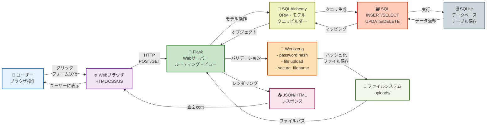

# ユーザー・技術スタック連携フロー

## ユーザー・技術スタック連携フロー（簡易版）

---

## 各技術の役割

### 👤 ユーザー
- ブラウザでアプリケーションを操作
- フォーム入力やボタンクリックでアクション実行

### 🌐 Webブラウザ
- HTML/CSS/JavaScriptを実行
- HTTPリクエストをサーバーに送信
- サーバーからのレスポンスを表示

### 🐍 Flask
- HTTPリクエストを受け取りルーティング
- ビュー関数でビジネスロジック実行
- テンプレートをレンダリング

### 🔧 Werkzeug
- **password hash**: ユーザーパスワードの暗号化
- **file upload**: ファイルアップロード処理
- **secure_filename**: セキュアなファイル名生成

### 🔗 SQLAlchemy
- Pythonのモデルオブジェクトとデータベース間のマッピング
- SQL文の自動生成
- データベースクエリの抽象化

### 🗃️ SQL
- INSERT: 新規データ挿入
- SELECT: データ取得
- UPDATE: データ更新
- DELETE: データ削除

### 🗄️ SQLite
- 実際のデータベース
- テーブルにデータを永続保存
- トランザクション管理

### 📁 ファイルシステム
- ユーザーアップロード画像の保存
- instance/uploads/ ディレクトリに格納

### 📤 レスポンス
- JSON: AJAX通信用
- HTML: ページ表示用
- クライアントに返送
