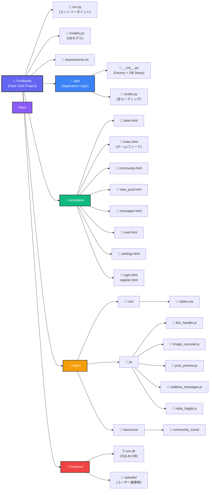
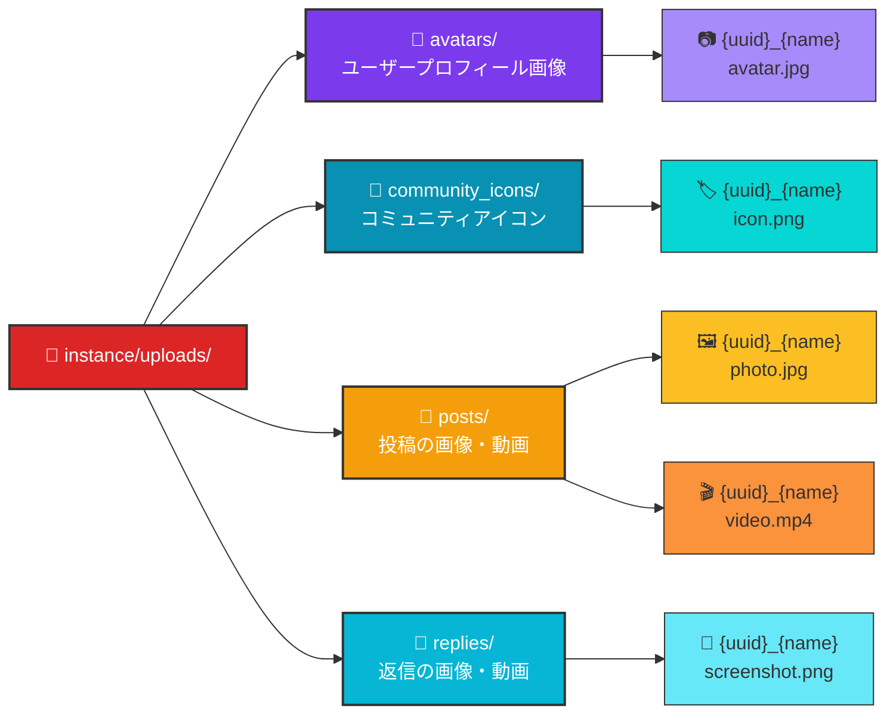

# SNS デモアプリケーション - システムアーキテクチャ

## 全体構造



---

## ファイルアップロード構成



| ディレクトリ | 用途 | 保存対象 |
|-----------|------|--------|
| `avatars/` | ユーザープロフィール画像 | 登録・編集時のアバター |
| `community_icons/` | コミュニティアイコン | コミュニティ作成時・プリセットアイコン |
| `posts/` | 投稿関連メディア | 投稿の画像（最大4個）と動画（1個） |
| `replies/` | 返信関連メディア | 返信の画像（最大4個）と動画（1個） |

### ファイル命名規則
```
{uuid.uuid4().hex}_{secure_filename(original_name)}
例: a1b2c3d4e5f6g7h8_photo.jpg
    9z8y7x6w5v4u_video.mp4
```

---

## データモデル (ERD)

```mermaid
erDiagram
    USER ||--o{ POST : creates
    USER ||--o{ MESSAGE : sends
    USER ||--o{ MESSAGE : receives
    USER ||--o{ REPLY : writes
    USER ||--o{ COMMUNITY-FOLLOW : has
    USER ||--o{ POST-LIKE : gives
    USER ||--o{ REPLY-LIKE : gives
    
    COMMUNITY ||--o{ POST : contains
    COMMUNITY ||--o{ COMMUNITY-FOLLOW : has
    
    POST ||--o{ POST-IMAGE : has
    POST ||--o{ REPLY : has
    POST ||--o{ POST-LIKE : receives
    
    REPLY ||--o{ REPLY-IMAGE : has
    REPLY ||--o{ REPLY-LIKE : receives
    REPLY ||--o{ REPLY : parent_of
    
    USER : int id PK
    USER : string username UK
    USER : string password_hash
    USER : string display_name
    USER : string avatar_filename
    USER : text bio
    
    POST : int id PK
    POST : text body
    POST : datetime created_at
    POST : int user_id FK
    POST : int community_id FK
    POST : string video_filename
    
    POST-IMAGE : int id PK
    POST-IMAGE : int post_id FK
    POST-IMAGE : string filename
    POST-IMAGE : int order
    
    MESSAGE : int id PK
    MESSAGE : text body
    MESSAGE : datetime created_at
    MESSAGE : int sender_id FK
    MESSAGE : int recipient_id FK
    MESSAGE : boolean is_read
    MESSAGE : datetime read_at
    
    REPLY : int id PK
    REPLY : text body
    REPLY : datetime created_at
    REPLY : int post_id FK
    REPLY : int user_id FK
    REPLY : int parent_id FK
    REPLY : string video_filename
    
    REPLY-IMAGE : int id PK
    REPLY-IMAGE : int reply_id FK
    REPLY-IMAGE : string filename
    REPLY-IMAGE : int order
    
    COMMUNITY : int id PK
    COMMUNITY : string name UK
    COMMUNITY : text description
    COMMUNITY : string icon_filename
    COMMUNITY : int created_by FK
    COMMUNITY : datetime created_at
    
    COMMUNITY-FOLLOW : int id PK
    COMMUNITY-FOLLOW : int user_id FK
    COMMUNITY-FOLLOW : int community_id FK
    
    POST-LIKE : int id PK
    POST-LIKE : int user_id FK
    POST-LIKE : int post_id FK
    
    REPLY-LIKE : int id PK
    REPLY-LIKE : int user_id FK
    REPLY-LIKE : int reply_id FK
```

---

## 主要機能フロー

### 1. ユーザー認証
```
ユーザー入力 → /register or /login → 
  ↓
  User.set_password() / check_password() →
  ↓
  session['user_id'] 設定 →
  ↓
  @bp.before_app_request で load_logged_in_user()
  g.user 設定、unread_count/following_ids計算
```

### 2. コミュニティ管理
```
/communities/new (POST)
  → Community 作成 → 自動フォロー
  
/communities/<id> (GET)
  → コミュニティ情報表示 + フォロワー/投稿統計
  
/communities/<id>/follow|unfollow (POST)
  → CommunityFollow レコード 追加/削除
```

### 3. 投稿フロー
```
/post (POST)
  → 本文, 画像(最大4個), 動画(1個) 検証
  → アップロード: instance/uploads/ に UUID付き保存
  → Post + PostImage レコード作成
  
/post/<id>/reply (POST)
  → 返信 → Reply + ReplyImage レコード作成
  
/post/<id>/like|unlike (AJAX)
  → PostLike/ReplyLike 追加/削除 → JSON応答
  
/post/<id>/delete (POST)
  → ファイル削除 + DB削除 + 返信も削除
```

### 4. メッセージング
```
/messages (GET/POST)
  → 会話パートナー一覧 + 最新メッセージ
  → unread_count 計算
  
/messages/<username> (GET/POST)
  → 相手とのスレッド表示
  → 受信メッセージ自動マーク読了
  
/api/messages/<username> (AJAX)
  → リアルタイム更新用 JSON API
  
/message/<id>/delete (POST)
  → メッセージ削除
```

### 5. ユーザープロフィール
```
/user/<username> (GET)
  → プロフィール情報表示
  → ユーザー投稿一覧 + ソート
  
/settings (GET/POST)
  → display_name, bio, avatar 編集
  → アバター削除機能（予定中状態、取消対応）
  
/account/delete (POST)
  → パスワード確認 → アカウント削除
  → 削除ロジック:
    1. 投稿・画像・動画ファイル削除
    2. 返信・画像・動画ファイル削除
    3. メッセージ（送受信両方）削除
    4. 作成コミュニティの所有権を最古参フォロワーに譲渡
       （フォロワーなしの場合はコミュニティも削除）
    5. アバターファイル削除
    6. ユーザーレコード削除
```

### 6. 検索機能
```
/search (GET/POST)
  → ユーザー名検索
  → 投稿本文検索
  → 日付範囲検索
  → ソート: latest/likes/replies
```

---

## ファイルストレージパターン

### アップロード管理
```
ディレクトリ: instance/uploads/

命名規則:
  {uuid.uuid4().hex}_{secure_filename(original_name)}
  例: a1b2c3d4e5f6_photo.jpg

検証:
  allowed_file() 関数で拡張子チェック
  ALLOWED_EXTENSIONS: png, jpg, jpeg, gif, mp4, webm, mov, avi, mkv
```

### ファイル削除ロジック
```
delete_post():
  1. PostImage ファイル削除
  2. 動画ファイル削除
  3. 返信の ReplyImage/動画ファイル削除
  4. DB レコード削除
  
delete_message():
  1. DB レコード削除
```

---

## API エンドポイント一覧

### 認証
| Method | Route | 説明 |
|--------|-------|------|
| GET/POST | `/register` | ユーザー登録 |
| GET/POST | `/login` | ログイン |
| GET | `/logout` | ログアウト |
| GET/POST | `/settings` | プロフィール編集 |
| POST | `/account/delete` | アカウント削除（パスワード確認） |

### コミュニティ
| Method | Route | 説明 |
|--------|-------|------|
| GET | `/` | ホーム/フィード (タブ: home/latest/search) |
| GET/POST | `/communities/new` | コミュニティ作成 |
| GET | `/communities/<id>` | コミュニティ詳細 |
| POST | `/communities/<id>/follow` | フォロー |
| POST | `/communities/<id>/unfollow` | フォロー解除 |
| POST | `/communities/<id>/delete` | コミュニティ削除 |

### 投稿
| Method | Route | 説明 |
|--------|-------|------|
| POST | `/post` | 投稿作成 |
| GET | `/post/<id>` | 投稿詳細 + 返信表示 |
| POST | `/post/<id>/reply` | 返信追加 |
| GET/POST | `/post/<id>/edit` | 編集不可 (設計仕様) |
| POST | `/post/<id>/delete` | 投稿削除 |
| POST | `/post/<id>/like` | いいね (AJAX) |
| POST | `/post/<id>/unlike` | いいね取消 (AJAX) |
| POST | `/reply/<id>/like` | 返信いいね (AJAX) |
| POST | `/reply/<id>/unlike` | 返信いいね取消 (AJAX) |

### メッセージング
| Method | Route | 説明 |
|--------|-------|------|
| GET/POST | `/messages` | メッセージ受信箱 |
| GET/POST | `/messages/<username>` | ユーザーとのスレッド |
| POST | `/message/<id>/delete` | メッセージ削除 |

### 検索・ユーザー
| Method | Route | 説明 |
|--------|-------|------|
| GET/POST | `/search` | 投稿検索 |
| GET | `/user/<username>` | ユーザープロフィール |
| GET | `/uploads/<filename>` | アップロード画像配信 |

### API (AJAX)
| Method | Route | 説明 |
|--------|-------|------|
| GET | `/api/messages/<username>` | メッセージ取得 (リアルタイム) |
| GET | `/api/unread-count` | 未読メッセージ数 |
| GET | `/api/partner-unread-count/<username>` | 特定パートナーの未読数 |
| GET | `/api/post/<id>/images` | 投稿画像一覧 |
| GET | `/api/reply/<id>/images` | 返信画像一覧 |

---

## 使用技術スタック

### バックエンド
- **Framework**: Flask 2.0+
- **ORM**: Flask-SQLAlchemy 2.5+
- **Database**: SQLite3
- **Security**: Werkzeug (password hashing)

### フロントエンド
- **HTML Template Engine**: Jinja2
- **CSS**: Bootstrap 5.3.2 + カスタム styles.css
- **JavaScript**: Vanilla JS (AJAX, realtime updates)

### ファイル処理
- **Upload**: Flask file handling + Werkzeug secure_filename
- **Storage**: instance/uploads/ (ローカルファイルシステム)

---

## 開発ワークフロー

### 環境セットアップ
```bash
# 1. リポジトリクローン
git clone <repo_url>

# 2. 依存パッケージインストール
pip install -r requirements.txt

# 3. サーバー起動
python run.py
# または
start.bat
```

### データベースリセット
```
1. instance/sns.db を削除
2. サーバー再起動
3. app/__init__.py の db.create_all() でテーブル自動生成
```

### デバッグモード
- `run.py` で `app.run(debug=True)` 設定済み
- ファイル変更で自動リロード有効

---

## 重要な設計パターン

### 1. Factory Pattern (Blueprint)
```python
# app/__init__.py
def create_app():
    app = Flask(__name__)
    app.config['SQLALCHEMY_DATABASE_URI'] = 'sqlite:///sns.db'
    db.init_app(app)
    
    from app.routes import bp
    app.register_blueprint(bp, url_prefix='/')
    
    return app
```

### 2. 認証ミドルウェア
```python
@bp.before_app_request
def load_logged_in_user():
    user_id = session.get('user_id')
    g.user = User.query.get(user_id) if user_id else None
    # g.unread_count, g.following_ids も計算
    # g.liked_post_ids, g.liked_reply_ids も計算
```

### 3. アカウント削除時の所有権譲渡
```python
# 作成コミュニティの処理
for community in Community.query.filter_by(created_by=user_id).all():
    # 削除対象ユーザー以外の最古参フォロワーを検索
    oldest_follow = CommunityFollow.query.filter_by(
        community_id=community.id
    ).filter(CommunityFollow.user_id != user_id).order_by(
        CommunityFollow.created_at.asc()
    ).first()
    
    if oldest_follow:
        # 所有権譲渡
        community.created_by = oldest_follow.user_id
    else:
        # フォロワーなしの場合はコミュニティ削除
        db.session.delete(community)
```

### 4. リアルタイム更新
- AJAX エンドポイント `/api/*` で JSON 応答
- JavaScript (`realtime_messages.js`) でポーリング
- Message テーブルの `is_read`, `read_at` フィールドで既読管理

### 4. ファイル削除ロジック
- 投稿・返信削除時に先に **ファイル削除**
- その後 DB レコード削除
- `request.form.get('next')` または `request.referrer` で削除後のリダイレクト先判定

---

## 注記

- **エディタ不可**: 投稿編集は意図的に非サポート
- **スキーマ管理**: マイグレーション機能なし、手動管理
- **テスト**: 自動テスト・CI/CD なし、手動テスト必須
- **日本語UI**: テンプレートは日本語対応
